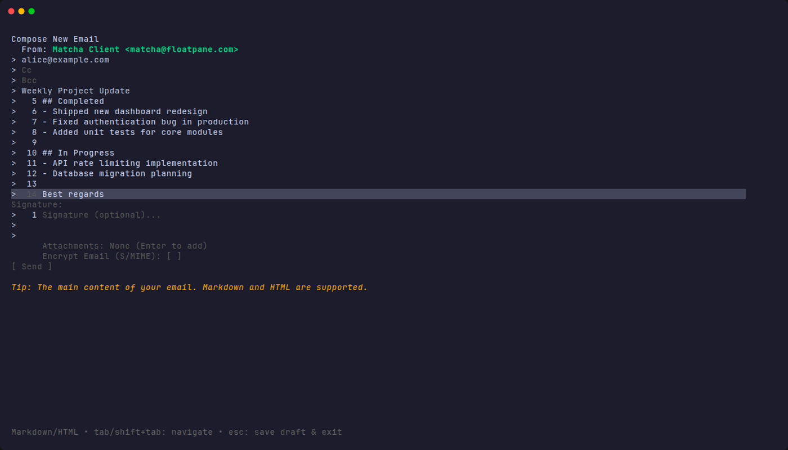
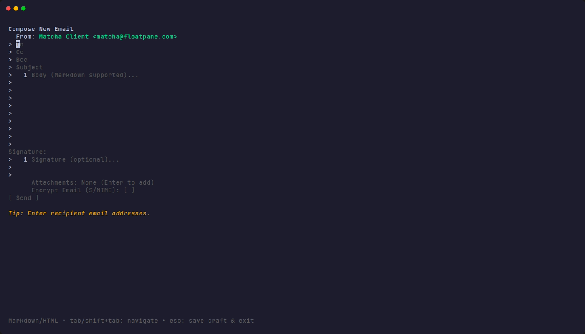

# Composing Emails

 

Matcha provides a clean, intuitive interface for writing emails.

## Features

- **✍️ Compose New Emails**: Start writing with a simple command.
- **📝 Markdown Support**: Write emails in Markdown that automatically converts to HTML.
- **🖼️ Inline Images**: Embed images in your emails using Markdown syntax ``.
- **📎 File Attachments**: Attach files with an integrated file picker.
- **👥 Contact Autocomplete**: Smart suggestions from your contact history.
- **💾 Auto-save Drafts**: Never lose your work - drafts are automatically saved.
- **📨 Multi-Account Sending**: Choose which account to send from with a simple picker.
- **↩️ Reply Threading**: Proper email threading with In-Reply-To and References headers.
- **🎨 Rich Formatting**: Send both plain text and HTML versions of your emails.
