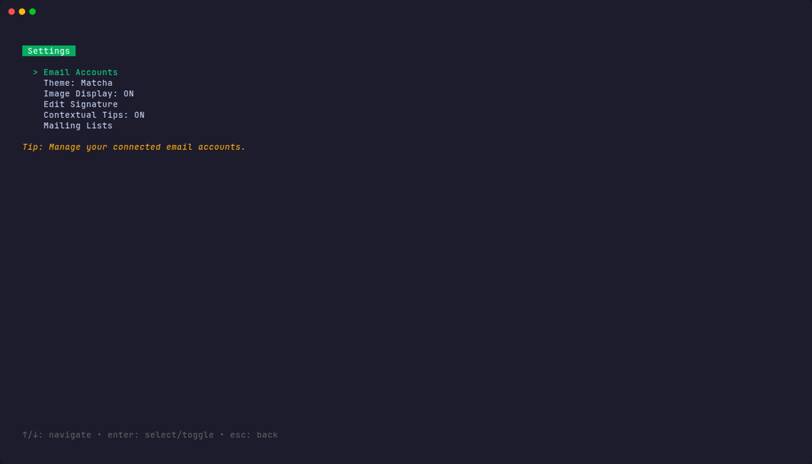

# Email Management

Matcha provides comprehensive tools for managing your emails directly from the terminal.

## Key Features

- **📬 Inbox & Sent Mail**: View and manage emails from both inbox and sent folders.
- **📧 Multi-Account Support**: Manage multiple email accounts with an elegant tabbed interface.
- **⚡ Smart Caching**: Instant inbox display with background refresh for optimal performance.
- **🔄 Real-time Refresh**: Manually refresh your inbox at any time with a single keypress.
- **♾️ Infinite Scroll**: Automatically loads more emails as you scroll through your inbox.
- **🔍 Search & Filter**: Built-in filtering to quickly find emails by subject, sender, or content.

## Rich Email Viewing

Matcha supports rendering various email formats:

- HTML email rendering with proper formatting.
- Markdown support for plain-text emails.
- Styled headers and body text.
- Proper handling of quoted-printable encoding.

## Actions

- **💬 Reply to Emails**: Quick reply with automatic quoting of original message.
- **🗑️ Delete & Archive**: Manage your inbox by deleting or archiving messages.
- **📎 Attachment Support**:
  - Download email attachments to your Downloads folder.
  - Automatic file opening after download.
  - Smart filename handling (prevents overwrites with auto-numbering).
  - Support for various attachment encodings.
