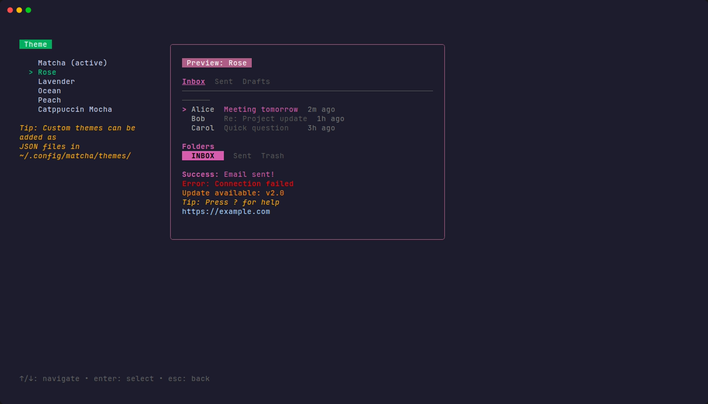

# Themes

Matcha supports color themes to personalize the look of your terminal email client. Choose from built-in themes or create your own.

## Changing the Theme

Go to **Settings > Theme** to browse available themes. A live preview panel on the right shows how each theme looks as you navigate the list. Press `enter` to apply the selected theme.

Your selection is saved to `config.json` and persists across sessions.



## Built-in Themes

| Theme                | Description                                                             |
| -------------------- | ----------------------------------------------------------------------- |
| **Matcha**           | The default green theme                                                 |
| **Rose**             | Soft pink and rose accents                                              |
| **Lavender**         | Purple and violet tones                                                 |
| **Ocean**            | Cool blue palette                                                       |
| **Peach**            | Warm orange and peach tones                                             |
| **Catppuccin Mocha** | Based on the popular [Catppuccin](https://catppuccin.com/) color scheme |

## Custom Themes

You can create your own themes by adding JSON files to `~/.config/matcha/themes/`. Each `.json` file in that directory will appear in the theme picker.

### Example Custom Theme

Create a file like `~/.config/matcha/themes/dracula.json`:

```json
{
  "name": "Dracula",
  "accent": "#BD93F9",
  "accent_dark": "#6272A4",
  "accent_text": "#F8F8F2",
  "secondary": "#6272A4",
  "subtle_text": "#6272A4",
  "muted_text": "#6272A4",
  "dim_text": "#F8F8F2",
  "danger": "#FF5555",
  "warning": "#FFB86C",
  "tip": "#F1FA8C",
  "link": "#8BE9FD",
  "directory": "#BD93F9",
  "contrast": "#282A36"
}
```

### Color Properties

| Property      | Used For                                                |
| ------------- | ------------------------------------------------------- |
| `accent`      | Selected items, focused elements, primary highlights    |
| `accent_dark` | Borders, title backgrounds                              |
| `accent_text` | Text on accent-colored backgrounds                      |
| `secondary`   | Help text, blurred/unfocused elements                   |
| `subtle_text` | List headers, hints                                     |
| `muted_text`  | Dates, timestamps                                       |
| `dim_text`    | Sender names, secondary info                            |
| `danger`      | Delete confirmations, errors                            |
| `warning`     | Update notifications                                    |
| `tip`         | Contextual tips                                         |
| `link`        | Hyperlinks in email content                             |
| `directory`   | Directory names in the file picker                      |
| `contrast`    | Text on accent-colored backgrounds (e.g. active folder) |

Colors can be specified as hex values (`#BD93F9`) or ANSI 256-color codes (`42`).
