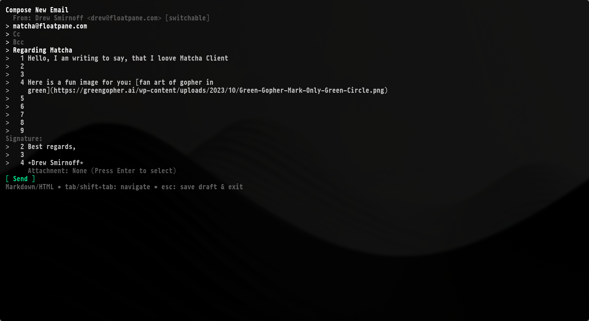

# 🍵 Welcome to Matcha

**Matcha** is a modern, beautiful, and feature-rich email client for the terminal, designed for speed and efficiency.

## Getting Started

Ready to dive in? Here are a few places to start:

- 🚀 [Installation Guide](.//installation.md) - Get Matcha running on your machine
- 📖 [Usage & Shortcuts](./usage.md) - Learn how to navigate the interface
- ⚙️ [Configuration](./Configuration.md) - Set up your accounts and preferences

## Core Features

Matcha is packed with features to make email management in the terminal a breeze:

- [**Email Management**](./Features/EMAIL_MANAGEMENT.md) - Read, reply, delete, and archive emails.
- [**Composing**](./Features/COMPOSING.md) - Write emails in Markdown with rich formatting support.
- [**Account Management**](./Features/ACCOUNTS.md) - Seamlessly manage multiple accounts.
- [**Contacts**](./Features/CONTACTS.md) - Keep your contacts organized and easily accessible.
- [**Drafts**](./Features/DRAFTS.md) - Save unfinished emails and pick them up later.
- [**UI**](./Features/UI.md) - A responsive, tabbed interface with color-coding and clear focus management.
- [**Advanced**](./Features/ADVANCED.md) - Automatic updates, smart image rendering, and performance optimization.

### Image & Hyperlink Support

- [Image Protocol Compatibility](./Features/Images.md)
- [Hyperlink Compatibility](./Features/Hyperlinks.md)

---

Join the community and contribute on [GitHub](https://github.com/floatpane/matcha)!
