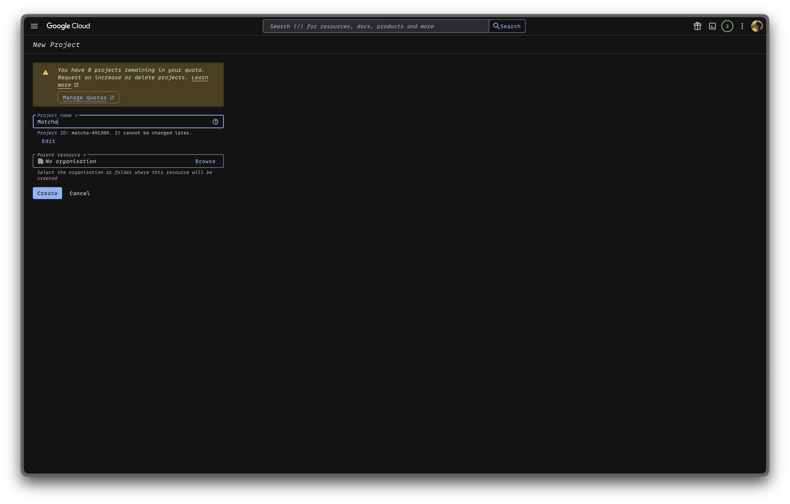
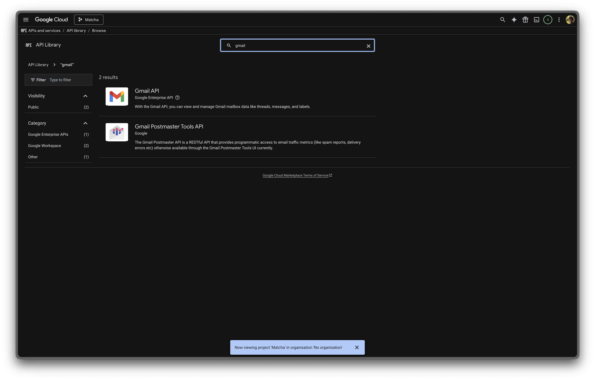
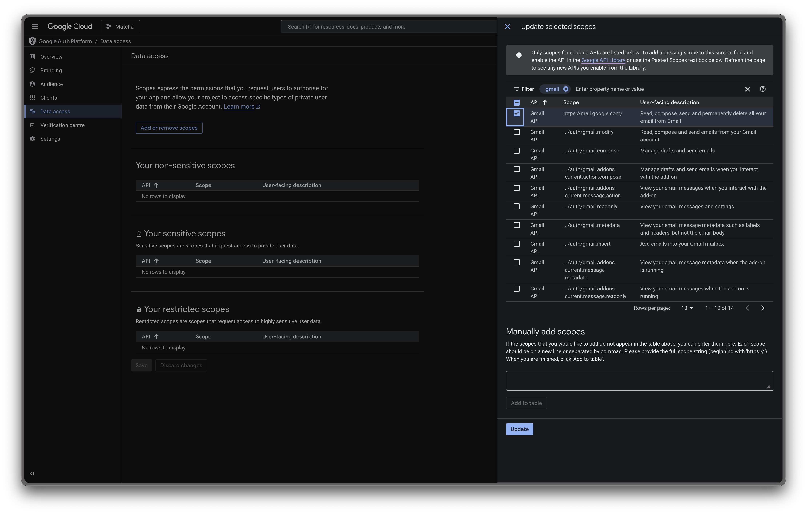
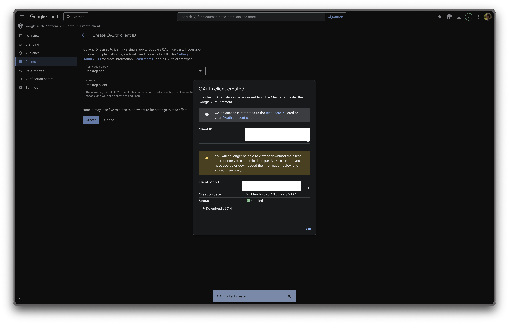
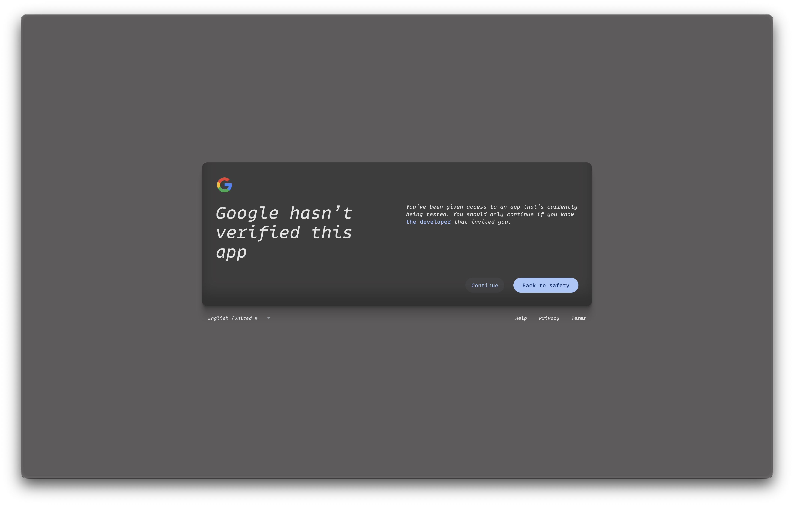
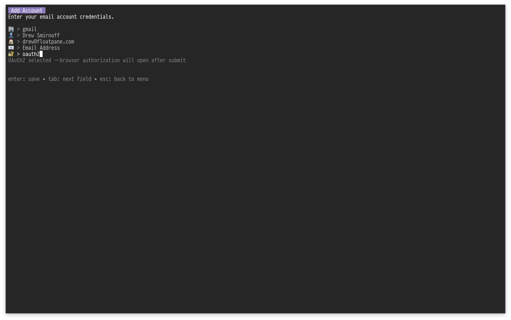

# Gmail setup

Matcha supports two ways to connect to Gmail:

- **OAuth2** (recommended) — sign in with your Google account in the browser, no app password needed
- **App Password** — generate a 16-character password from Google's security settings

---

## Option A: OAuth2 (recommended)

OAuth2 lets you authorize Matcha through Google's standard sign-in flow. No app passwords required.

### 1. Create a Google Cloud project

1. Go to [console.cloud.google.com](https://console.cloud.google.com).
2. Click the project dropdown at the top and select **New Project**.
3. Name it something like "Matcha" and click **Create**.

  

### 2. Enable the Gmail API

1. In the left sidebar, go to **APIs & Services** → **Library**.
2. Search for **Gmail API**.
3. Click it and press **Enable**.

  

### 3. Configure the OAuth consent screen

1. Go to **APIs & Services** → **OAuth consent screen**.
2. Select **External** as the user type and click **Create**.
3. Fill in the required fields:
   - **App name**: Matcha
   - **User support email**: your email
   - **Developer contact email**: your email
4. Click **Create**.
5. On the left sidebar, click **Data access**, search for `Gmail`, check it, and click **Update** → **Save**.
6. On the left sidebar, click **Audience**, then **Add Users** under **Test Users** enter your Gmail address, and click **Save**.

  

> **Note:** Your app will be in "Testing" mode, which is perfectly fine for personal use. Google will show an "unverified app" warning during sign-in — just click **Continue**. Tokens in testing mode expire after 7 days, after which you'll need to re-authorize with `matcha gmail auth`.

### 4. Create OAuth credentials

1. Go to **Clients**.
2. Click **Create Client** at the top of the screen.
3. Application type: **Desktop app**.
4. Name: anything (e.g. "Matcha").
5. Click **Create**.
6. Copy the **Client ID** and **Client Secret**.

  

### 5. Save your client credentials

Create the file `~/.config/matcha/oauth_client.json`:

```json
{
  "client_id": "YOUR_CLIENT_ID",
  "client_secret": "YOUR_CLIENT_SECRET"
}
```

Or pass them directly in the next step.

### 6. Authorize your Gmail account

Run the following command in your terminal:

```bash
matcha oauth auth your@gmail.com
```

Or with inline credentials:

```bash
matcha oauth auth your@gmail.com --client-id YOUR_ID --client-secret YOUR_SECRET
```

A browser window will open. Sign in with your Google account and grant access. Once authorized, you'll see "Authorization complete!" in your terminal.

  
 > **Note**: click "Continue" here

### 7. Add your account in Matcha

From Matcha, open settings and choose to add a new account. Enter:

- **Provider**: gmail
- **Display name**: The name that will appear on emails you send
- **Username**: Your Gmail address
- **Email Address**: The Gmail address to fetch messages from (usually the same as Username)
- **Send As Email**: Optional. Set this if you want the outgoing `From` header to use a verified Gmail alias instead of your login address
- **Auth Method**: oauth2

No password is needed — Matcha will use the tokens from the authorization step.

  

### Managing OAuth tokens

```bash
# Get a fresh access token (auto-refreshes if expired)
matcha oauth token your@gmail.com

# Revoke and delete stored tokens
matcha oauth revoke your@gmail.com

# Re-authorize (e.g. after token expiry in testing mode)
matcha oauth auth your@gmail.com
```

---

## Option B: App Password

If you prefer not to set up OAuth2, you can use an app password instead. App Passwords are available only after 2-Step Verification is turned on.

## 1. Open Google account security settings

1. Go to [https://myaccount.google.com](https://myaccount.google.com).
2. In the left menu, click **Security**.

## 2. Enable 2-Step Verification (if not enabled)

1. In **How you sign in to Google**, click **2-Step Verification**.
2. Follow the setup flow (phone prompt, SMS, authenticator app, or security key).

## 3. Create an App Password

1. Go to [https://myaccount.google.com/u/2/apppasswords](https://myaccount.google.com/u/2/apppasswords).
2. Sign in again if prompted.
3. Choose a name for your app password (e.g., "Matcha").
4. Click **Generate**.
5. Copy the 16-character app password shown by Google.

> **⚠️ Important:** Treat this app password as you would your primary password. Never share it, or expose it publicly. This credential grants full access to your Gmail account. The app password sits locally in your device and is never shared with us.


## 4. Open account setup in Matcha

From Matcha, open settings and choose to add a new account.

## 5. Enter Gmail credentials in Matcha

In Matcha account setup:

- Provider: gmail
- Display name: The name that will appear on the emails you send
- Username: Your Gmail address
- Email Address: The Gmail address used to fetch messages from (most likely the same as the Username)
- Password: the generated 16-character app password (not your normal Google password)


---

## Troubleshooting

| Issue                              | Solution                                                                                                                          |
| ---------------------------------- | --------------------------------------------------------------------------------------------------------------------------------- |
| **Invalid credentials**            | Verify you're using the 16-character app password, not your regular Google account password.                                      |
| **"App passwords" option missing** | Confirm 2-Step Verification is enabled in your account settings. Some organizations restrict app passwords via security policies. |
| **Connection still fails**         | In Google Account, revoke the current app password and generate a new one. Then update your credentials in Matcha.                |
| **OAuth2: "unverified app" warning** | This is normal in testing mode. Click **Advanced** → **Go to Matcha (unsafe)** to continue.                                     |
| **OAuth2: token expired**          | In testing mode tokens expire after 7 days. Run `matcha oauth auth your@gmail.com` to re-authorize.                              |
| **OAuth2: refresh failed**         | Your refresh token may have been revoked. Run `matcha oauth auth your@gmail.com` to re-authorize from scratch.                    |
| **"python3 not found"**            | OAuth2 requires Python 3. Install it via your package manager (e.g. `brew install python3`, `apt install python3`).               |
