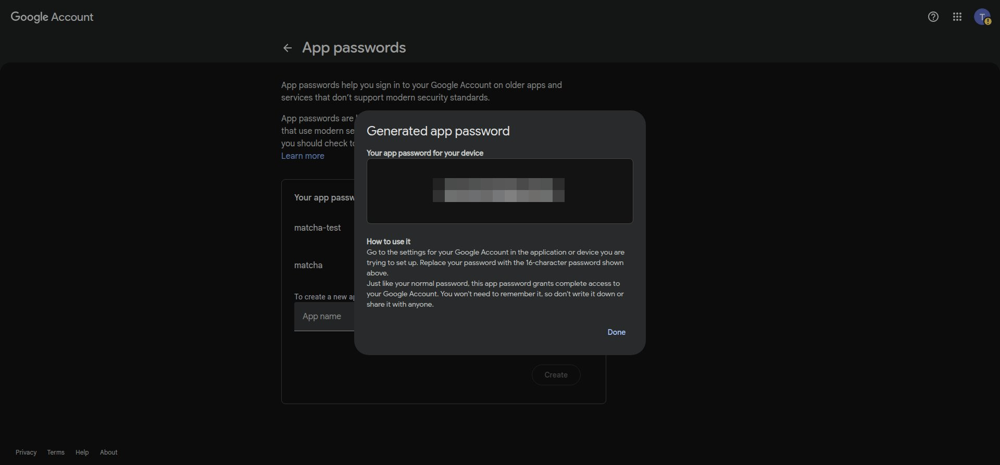
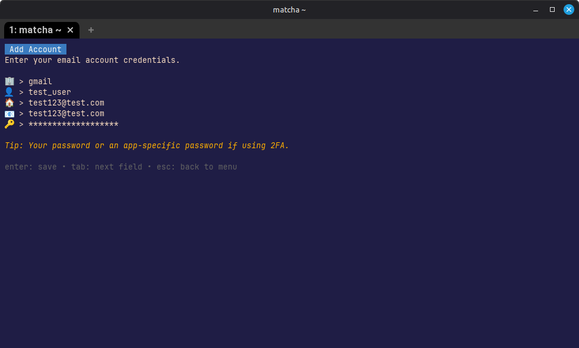

# Gmail setup

Matcha requires using app passwords to access your gmail account. App Passwords are available only after 2-Step Verification is turned on.

## 1. Open Google account security settings

1. Go to [https://myaccount.google.com](https://myaccount.google.com).
2. In the left menu, click **Security**.

## 2. Enable 2-Step Verification (if not enabled)

1. In **How you sign in to Google**, click **2-Step Verification**.
2. Follow the setup flow (phone prompt, SMS, authenticator app, or security key).

## 3. Create an App Password

1. Go to [https://myaccount.google.com/u/2/apppasswords](https://myaccount.google.com/u/2/apppasswords).
2. Sign in again if prompted.
3. Choose a name for your app password (e.g., "Matcha").
4. Click **Generate**.
5. Copy the 16-character app password shown by Google.

> **⚠️ Important:** Treat this app password as you would your primary password. Never share it, or expose it publicly. This credential grants full access to your Gmail account. The app password sits locally in your device and is never shared with us.

## 4. Open account setup in Matcha

From Matcha, open settings and choose to add a new account.

## 5. Enter Gmail credentials in Matcha

In Matcha account setup:

- Provider: gmail
- Display name: The name that will appear on the emails you send
- Username: Your Gmail address
- Email Address: The Gmail address used to fetch messages from(most likely the same as the Username)
- Password: the generated 16-character app password (not your normal Google password)

## Troubleshooting

| Issue                              | Solution                                                                                                                          |
| ---------------------------------- | --------------------------------------------------------------------------------------------------------------------------------- |
| **Invalid credentials**            | Verify you're using the 16-character app password, not your regular Google account password.                                      |
| **"App passwords" option missing** | Confirm 2-Step Verification is enabled in your account settings. Some organizations restrict app passwords via security policies. |
| **Connection still fails**         | In Google Account, revoke the current app password and generate a new one. Then update your credentials in Matcha.                |
